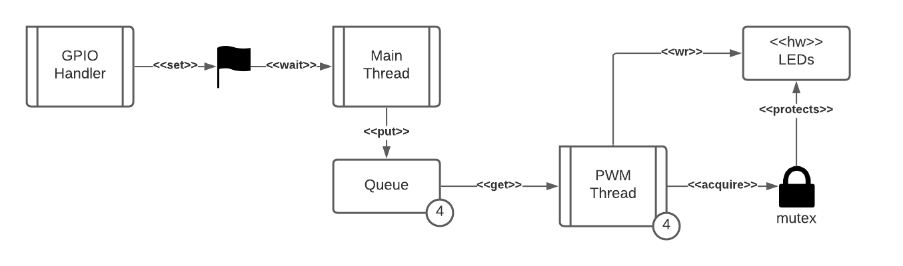

# Lab 06

## Goal

Control 4 LEDs independently. Each has its own Software PWM thread.

A main thread receives events from 2 push buttons and does the following:

- On Switch 1 press, select the next LED
- On Switch 2 press, increase intensity of current LED by 10%

The main thread communicates with other threads via a Message Queue.

The main thread receives button press events via a Thread Flag set by an Interrupt.

The LED threads use a Mutex to guarantee critical area access.

[Instructions (Portuguese)](./lab6.pdf)

## Diagram

